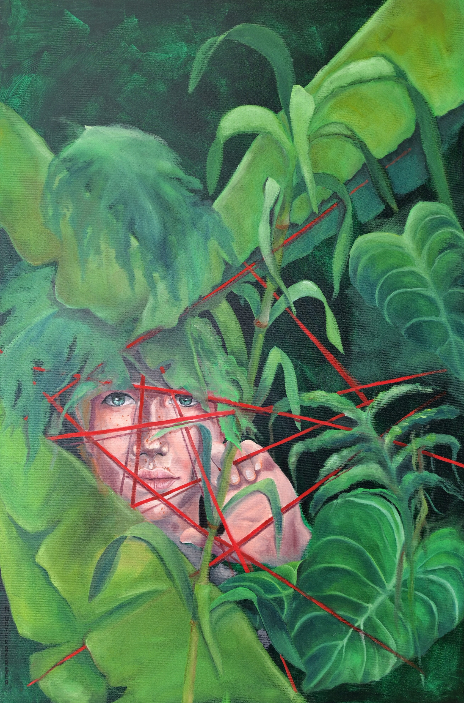

# Verstrickung

**Titel:** Verstrickung 
**Technik:** Öl auf Leinwand  
**Größe:** 120 × 80 × 4,5 cm  
**Jahr:** 2026 
**Preis:** € 3.400

## Bildbeschreibung

Der moderne Mensch lebt zwischen Überfluss und Enge, Sichtbarkeit und Einsamkeit. Umgeben von Konsum, Erwartungen und unsichtbaren Regeln sucht er nach Schutz - und verliert dabei
zunehmend seinen Raum.

Menschen werden verpackt, eingeordnet und funktional gemacht. Die üppige Pflanzenwelt erscheint zunächst als Rückzugsort, doch auch sie wird zum undurchdringlichen Geflecht.
Rote Linien durchschneiden das vermeintliche Paradies: Sie stehen für Kontrolle, Abhängigkeit und gesellschaftliche Grenzen.

"Verstrickung" zeigt eine Welt voller Möglichkeiten, in der dennoch kaum Platz zum wirklichen Leben bleibt.
